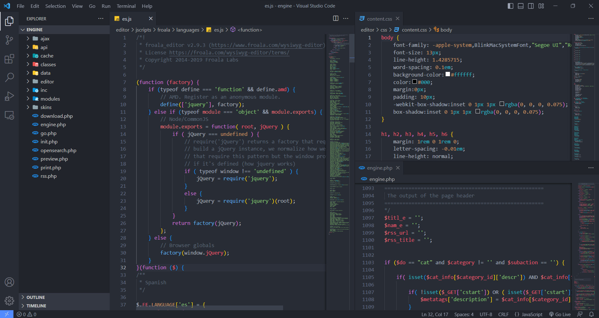

# Webcubic Theme for Visual Studio Code

## Installation

1. Open Extensions sidebar panel in VS Code. **View → Extensions**
2. Search for **Webcubic Theme**
3. Click **Install** to install it.
4. Click **Reload** to reload the editor.
5. File > Preferences > Color Theme > Webcubic (Dark)

## Contributing

If there are any problems, open an issue. I'll fix it if possible.

## License

[MIT License](./LICENSE) © Webcubic Theme